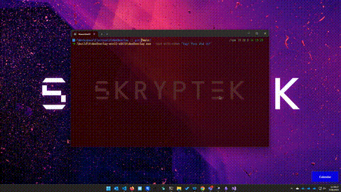

# Video Overlay Electron App - (ElectronConfetti)

A fullscreen transparent video overlay application built with Electron.js that plays a video file over the desktop and automatically exits when playback is complete.

## Demo



## Features

- **Fullscreen Transparent Overlay**: Displays video content over the entire desktop
- **Text Message Overlay**: Display custom text messages in large, centered letters
- **Flexible Display Modes**: Show text-only, video-only, or text with video background
- **Auto-Exit**: Application automatically closes when video playback finishes
- **Multiple Format Support**: Supports MP4, WebM, and MOV video formats
- **Always On Top**: Overlay stays above all other windows
- **Escape to Exit**: Press Escape key to manually exit the application
- **Error Handling**: Graceful error handling with user feedback
- **Responsive Text**: Text size adapts to screen resolution

## Setup

1. **Install Dependencies**:
   ```bash
   npm install
   ```

2. **Add Your Video File**:
   Place your video file in the `video` directory with one of these names:
   - `overlay.webm` (recommended)
   - `overlay.mp4`
   - `overlay.mov`

## Usage

### Video Overlay Mode
```bash
npm start
```

### Text Overlay Mode
Display custom text message in big centered letters:
```bash
# Show text only (no video)
npm run text "Your Message Here"

# Demo with preset text
npm run text-demo

# Show text with video background
npm run text-with-video "Your Message Here"

# Command line usage
electron . --text "Your Custom Message"
electron . --text-with-video "Message with Video Background"
```

### Build for Production
```bash
npm run build
```

### Package for Distribution
```bash
npm run dist
```

## Building as EXE

To compile the application as a Windows executable:

### Quick Build
```bash
npm run package-win
```

### Using Batch File
```bash
build.bat
```

This creates `build/VideoOverlay-win32-x64/VideoOverlay.exe` - a standalone executable that includes all dependencies.

**Usage of EXE:**
```bash
VideoOverlay.exe --text "Your Message"
VideoOverlay.exe --text-with-video "Message with Video"
```

See [BUILD.md](BUILD.md) for detailed build instructions and distribution guidelines.

## Video Requirements

- **Supported Formats**: MP4, WebM, MOV
- **Recommended Format**: MP4 with H.264 codec
- **File Location**: Place video files in the `video/` directory
- **File Naming**: Name your file `overlay.mp4`, `overlay.webm`, or `overlay.mov`

## Transparency Notes

- The application window is fully transparent
- Video content will be visible while maintaining desktop transparency
- For best results, use videos with alpha channels or green screen content

## Controls

- **Escape Key**: Exit the application at any time (with graceful text fade-out if applicable)
- **Automatic Exit**: Application closes when video playback completes (with graceful text fade-out if text overlay is shown)
- **Text-Only Auto-Exit**: 8 seconds display + 2 seconds fade-out = 10 seconds total
- **No Window Controls**: Frameless window for seamless overlay experience

## Text Overlay Configuration

### Text-Only Mode
- Displays only text message, no video background
- Auto-exits after 8 seconds with a 2-second graceful fade-out (10 seconds total)
- Perfect for notifications or announcements

### Text with Video Mode  
- Shows text overlaid on top of video background
- Gracefully fades out text when video completes or via Escape key
- Great for branded messages or presentations

### Text Styling
- Large, bold font (72px, responsive)
- White text with black shadow for readability
- Supports multi-line text (use \n for line breaks)
- Automatically wraps long text
- Smooth fade-in animation on entrance
- Graceful fade-out animation on exit (2 seconds)

## Troubleshooting

### Video Not Loading
1. Verify video file exists in the `video/` directory
2. Check that filename matches supported names (overlay.mp4, overlay.webm, overlay.mov)
3. Ensure video format is supported by Chromium

### Application Not Responding
- Press Escape key to force exit
- Check console output for error messages

### Performance Issues
- Use optimized video files (lower resolution/bitrate if needed)
- Ensure sufficient system resources are available

### Desktop Animation Freezing
The app now includes optimizations to prevent desktop animations from freezing:
- Uses mouse event pass-through to allow desktop interaction
- Optimized window composition settings
- GPU acceleration flags for better performance
- If desktop still freezes, try running other applications before starting the overlay

## Technical Details

- **Framework**: Electron.js
- **Renderer**: Chromium-based video playback
- **Window Type**: Frameless, transparent, always-on-top
- **IPC Communication**: Main process and renderer communication for exit handling

## Development

The application consists of:
- `main.js`: Main Electron process with window management
- `index.html`: Renderer process with video playback interface
- `package.json`: Node.js dependencies and scripts

## License

ISC License
